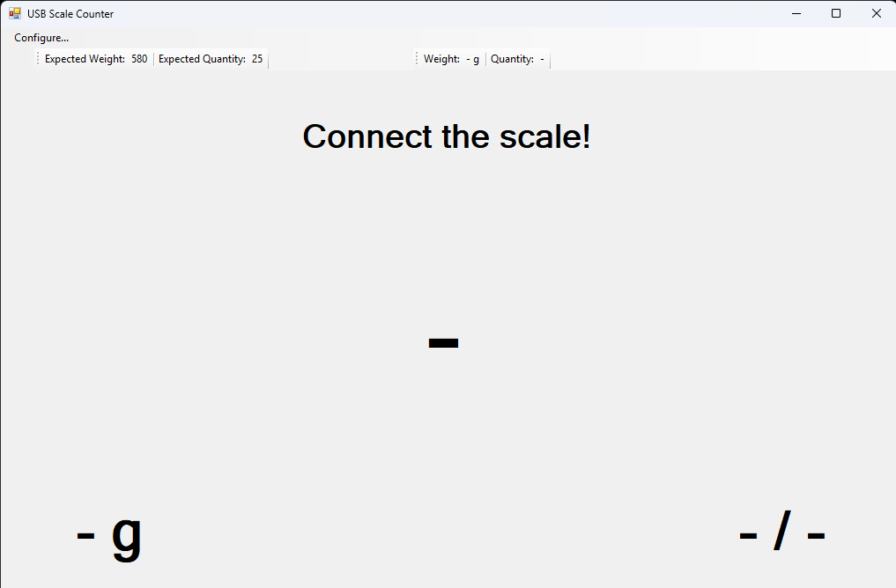
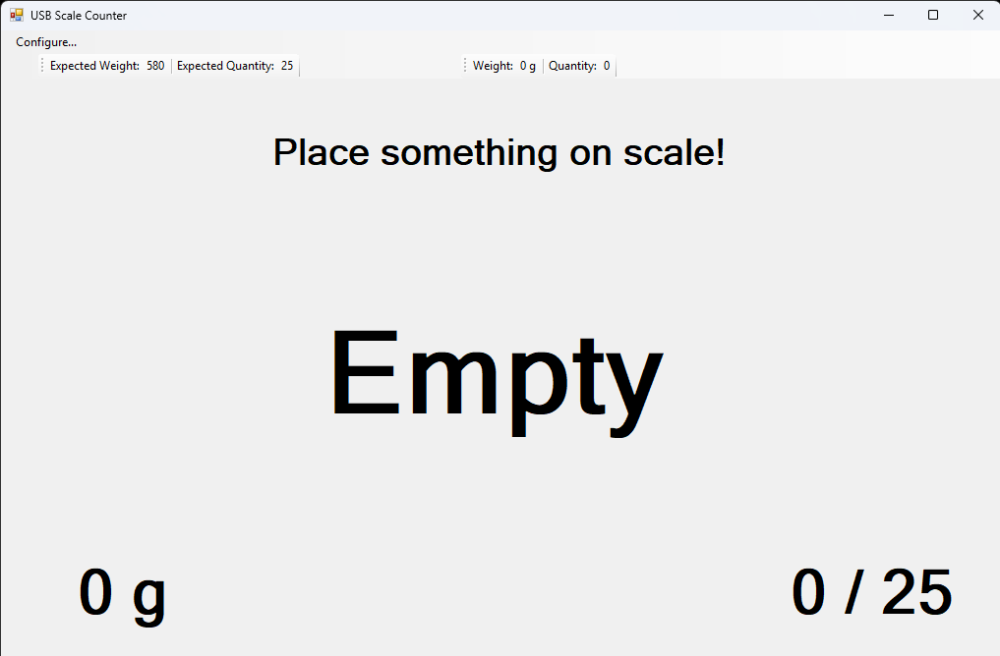
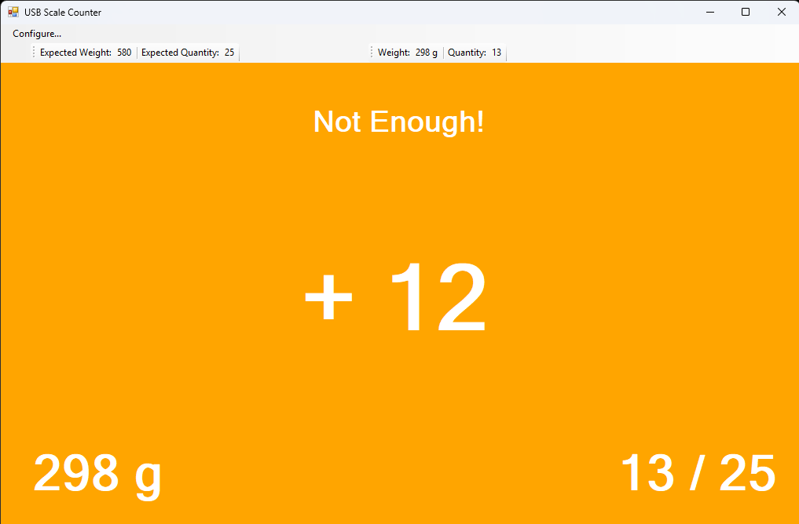
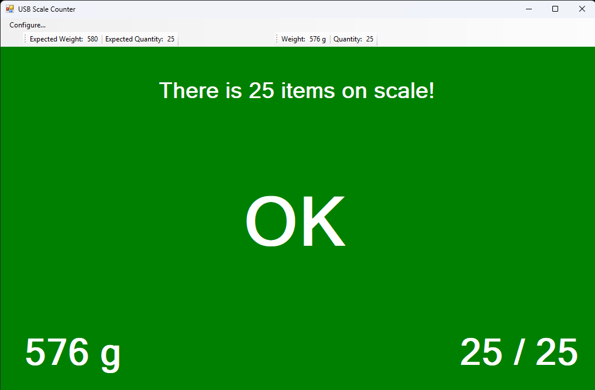
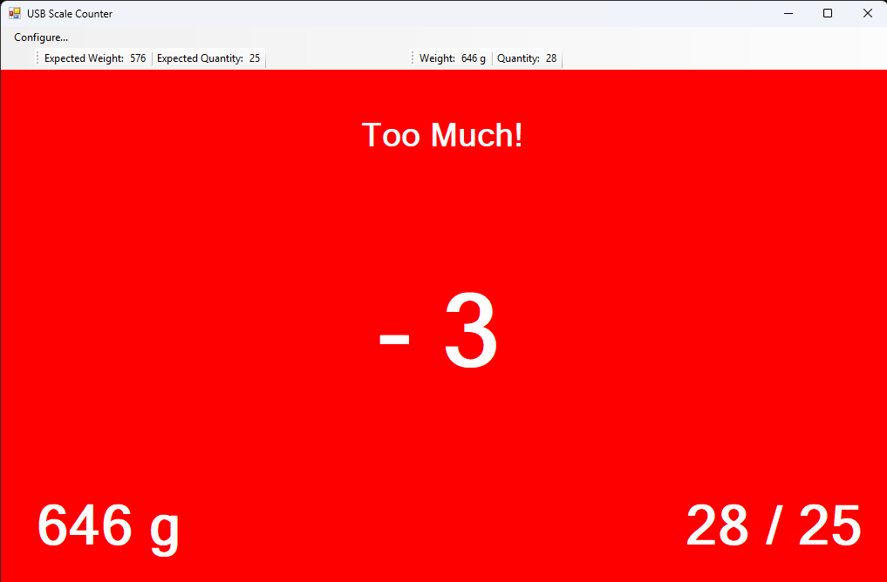

# USB Scale Counter

Count identical items quickly and accurately using a Dymo M10 USB postal scale.

## Documentation

Check here for documentation: https://opensource.duma.sh/apps/usb-scale-counter

## Installation

Install using ClickOnce: https://kduma-oss.github.io/CS-usb-scale-counter/USBScaleCounter.application

## Screenshots

| Disconnected | Empty Scale | Not Enough Items | Exact Count | Too Many Items |
|:---:|:---:|:---:|:---:|:---:|
|  |  |  |  |  |

## How It Works

1. Configure the expected weight of a single item and the target quantity.
2. Place items on the scale.
3. The app calculates the count and provides color-coded feedback:
   - **Orange** — fewer items than expected
   - **Green** — exact count reached
   - **Red** — too many items

## Requirements

- Dymo M10 USB postal scale
- Windows

